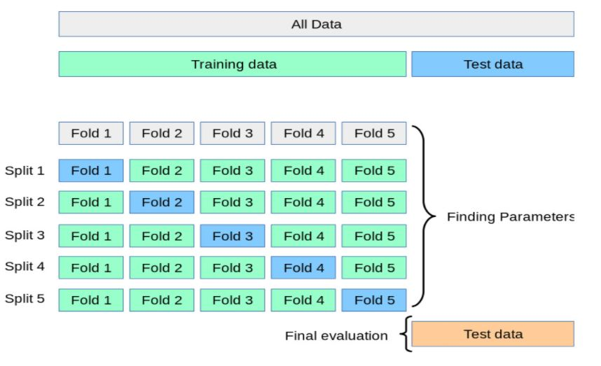

--- 
title: "Trabajo Práctico Final"
subtitle: 'Introducción a Data Mining'
author: "Martina Di Carlo"
date: "Febrero 2021"
output: 
  html_document:
    theme: flatly
    highlight: haddock
    toc: true
    toc_float:
      collapsed: true
      smooth_scroll: true
lang: es-ar
editor_options:
  chunk_output_type: console
  
---

# Introducción  

**Estudio de prevención cardiovascular en el adulto mayor**   
El incremento de la expectativa de vida ha generado un aumento en la incidencia de enfermedades cardiovasculares y neurológicas. En los adultos mayores es donde se conjugan diversas patologías con alta morbi-mortalidad requiriendo gran cantidad de recursos materiales y humanos. Dado que, la determinación en análisis sanguíneos de rutina permite la detección de alteraciones que en determinadas circunstancias podrían progresar a patologías definidas con serias repercusiones cardiovasculares en este grupo poblacional, se estudió la frecuencia en adultos mayores de diversas patologías subclínicas y la asociación entre los factores de riesgo cardiovascular y dichas patologías subclínicas. 


```{r setup, include = FALSE}
knitr::opts_chunk$set(echo = FALSE, 
                      warning = FALSE, 
                      message = FALSE, 
                      comment = NA, 
                      fig.align = "center", 
          #            out.width = "100%",
                      fig.width=6, 
                      fig.height=4)
```


```{r seteo inicial}

lista_paquetes = c('readxl','tidyverse','dplyr', 'pastecs' ,'psych','DescTools', 'here','knitr', 'kableExtra', 'ggplot2', 'reshape', 'corrplot', 'factoextra', 'MAP',  'ROCR', 'pROC','caret', 'rpart','rpart.plot', 'caTools' )
nuevos_paquetes = lista_paquetes[!(lista_paquetes %in% installed.packages()[,"Package"])]
if(length(nuevos_paquetes)) install.packages(nuevos_paquetes, dependencies = TRUE)

suppressWarnings(suppressMessages(easypackages::libraries(lista_paquetes)))

PATH_0 = here('Final')

PATH = here::here('Final', 'data') 

#Seteo el tema que usaremos para los grádficos
theme_set(theme_bw())

```

Se cuenta con información de 68 personas de ambos sexos mayores de 60 años, a quienes se les midieron las siguientes variables:  

- <ins>sexo:</ins> Sexo del paciente (0: Femenino,  1: Masculino).    
- <ins>imc:</ins> Índice de masa corporal (es el cociente del peso en kg y la estatura al cuadrado en metros).  
- <ins>perímetro_abdo:</ins> Perímetro abdominal (en centímetros).    
-  <ins>Hematocrito:</ins> (porcentaje del volumen de eritrocitos en el volumen de sangre).    
- <ins>glicemia:</ins> Glicemia (en mg/dL).     
- <ins>ct:</ins> Colesterol Total (en mg/dL).    
- <ins>hdl:</ins> Colesterol HDL (en mg/dL).    
- <ins>tgd:</ins> Triglicéridos (en mg/dL).  

Vemos las primeras filas del dataset:  


```{r carga de datos y head}
df_cardio = readxl::read_excel(file.path(PATH,'cardio.xls'),
                              col_names = T 
                              )
 df_cardio = df_cardio %>% 
             mutate(sexo = case_when(sexo == 0 ~ 'F',
                                     TRUE ~ 'M'
                                     ),
                    sexo = as.factor(sexo)
                   )

head(df_cardio) %>% 
kbl() %>%
kable_styling(bootstrap_options = c("striped", "hover", "condensed")) 
                     
```
*Tabla 1 - Preview de los datos*  

Analizamos ahora el tipo de las columnas:

```{r }
str(df_cardio)
```

Resumimos ahora las estadísticas descriptivas de los datos numéricos:

```{r }
pastecs::stat.desc((df_cardio %>% select(-sexo)))  %>% 
kbl() %>%
kable_styling(bootstrap_options = c("striped", "hover", "condensed"))  %>% 
scroll_box(width = "850px")
```
*Tabla 2 - Medidas resumen de los datos*  

## a. Distribución univariada de las variables presentes  

Todos los gráficos realizados a continuación serán abiertos por sexo, esto nos permitirá entender mejor los valores extremos que puedan aparecer.  

### Índice de masa corporal
```{r }

g = ggplot(df_cardio) +
    aes(x = imc, y = sexo, fill = sexo) +
    geom_boxplot(alpha=0.9) +
    theme(legend.position="none") +
    scale_fill_brewer(palette="BuPu") +
    labs(y = "sexo", 
         x = "Índice de Masa Corporal",
         caption = 'Gráfico 1 - Boxplot del Indice de Masa Corporal') 
    
plot(g)

```
Podemos ver la presencia de algunos valores extremos, pero son muy pocos, en ambos sexos.  


### Perímetro Abdominal
```{r }

g = ggplot(df_cardio) +
    aes(x = perimetro_abdo , y = sexo, fill = sexo) +
    geom_boxplot(alpha=0.9) +
    theme(legend.position="none") +
    scale_fill_brewer(palette="BuPu") +
    labs(y = "sexo", 
         x = "Perímetro Abdominal",
         caption = 'Gráfico 2 - Boxplot del Perímetro Abdominal') 
    
plot(g)

```
En el caso de los hombres, tenemos 3 valores extremos en el perímetro abdominal. Pueden ser personas con obesidad.  

### Hematocrito 
```{r }

g = ggplot(df_cardio) +
    aes(x = hto, y = sexo, fill = sexo) +
    geom_boxplot(alpha=0.9) +
    theme(legend.position="none") +
    scale_fill_brewer(palette="BuPu") +
    labs(y = "sexo",
         x = "Hematocrito",
         caption = 'Gráfico 3 - Boxplot de los Hematocritos')  
    
plot(g)

```
En este caso podemos ver que hay 3 valores extremos en el caso de las mujeres.  


### Glicemia  
```{r }

g = ggplot(df_cardio) +
    aes(x = glicemia, y = sexo, fill = sexo) +
    geom_boxplot(alpha=0.9) +
    theme(legend.position="none") +
    scale_fill_brewer(palette="BuPu") +
    labs(y = "sexo",
         x = "Glicemia",
         caption = 'Gráfico 4 - Boxplot de la Glicemia')  
    
plot(g)

```
Aquí tenemos dos valores muy extremos en el caso de los hombres.  

### Colesterol Total  
```{r }

g = ggplot(df_cardio) +
    aes(x = ct, y = sexo, fill = sexo) +
    geom_boxplot(alpha=0.9) +
    theme(legend.position="none") +
    scale_fill_brewer(palette="BuPu") +
    labs(y = "sexo", 
         x = "Colesterol Total",
         caption = 'Gráfico 5 - Boxplot del Colesterol Total') 
    
plot(g)

```
Aquí tenemos un solo caso extremo con 1 hombre.  

Al tener 

### Colesterol HDL  
```{r }

g = ggplot(df_cardio) +
    aes(x = hdl, y = sexo, fill = sexo) +
    geom_boxplot(alpha=0.9) +
    theme(legend.position="none") +
    scale_fill_brewer(palette="BuPu") +
    labs(y = "sexo", 
         x = "Colesterol HDL",
         caption = 'Gráfico 6 - Boxplot del colesterol hdl') 
    
plot(g)

```
Aquí vemos 2 casos extremos para los hombres y 2 para las mujeres, uno muy pequeño y otro muy grande.  


### Triglicéridos
```{r }

g = ggplot(df_cardio) +
    aes(x = tgd, y = sexo, fill = sexo) +
    geom_boxplot(alpha=0.9) +
    theme(legend.position="none") +
    scale_fill_brewer(palette="BuPu") +
    labs(y = "sexo", 
         x = "Triglicéridos",
         caption = 'Gráfico 7 - Boxplot de los triglicéridos') 
    
plot(g)

```

Los triglicéridos muestran la mayor cantidad de casos extremos en las mujeres, presentándose valores demasiado altos. Y tenemos dos casos para los hombres.

## b. Matriz de correlaciones  

Arrancamos con la tabla de correlaciones entre nuestras variables numéricas:  
```{r }
cor(df_cardio %>% select(-id, -sexo)) %>% 
kbl() %>%
kable_styling(bootstrap_options = c("striped", "hover", "condensed"))

```
*Tabla 3 - Tabla de correlaciones de nuestras variables numéricas*   

Realizamos el gráfico de Pairs Panels que ayuda a sacar conclusiones visualmente:  

```{r }
pairs.panels(df_cardio %>% select(-id, -sexo), 
             method = "pearson", # correlation method
             hist.col = "#00AFBB",
             density = TRUE,  # show density plots
             ellipses = TRUE, # show correlation ellipses
             
             
)
```
*Gráfico 8 - Pairs Panels*      

 Podemos ver que el perímetro abdominal se encuentra correlacionado positivamente con con el índice de masa corporal.  Se encuentra una leve correlación negativa entre el Colesterol HDL y los triglicéridos, estando estos últimos también levemente correlacionados de forma positiva con el colesterol total. No se notan correlaciones muy evidentes en el resto de los valores numéricos.  
Para terminar de validar esto, realizamos un gráfico de puntos entre el índice de masa corporal y el perímetro abdominal:  

```{r}
ggplot(df_cardio) + 
  aes(x = imc, y=perimetro_abdo) + 
  geom_point()+
  labs(x = 'Indice de masa corporal',
       y = 'Perímetro abdominal en centímetros',
       caption = 'Gráfico 9 - Scatter plot entre imc y perímetro abdominal')


```

Recordamos que el imc es el cociente entre el peso y la estatura de la persona. Esto tiene sentido, ya que a mayor perímetro abdominal se supone que mas peso tendrá la persona y este cociente aumentará.  

## c. PCA  

El método sirve para reducir la cantidad de variables, cuando tenemos datasets con mucha cantidad de columnas correladas entre sí.  

Antes que nada tendríamos que seleccionar si utilizaremos R o S. En este caso, cada una de las variables tiene una escala propia y si bien algunas se parecen no tenemos los mismos rangos entre todas. Es por esto, que decidí utilizar R. Además, como vimos hay presencia de outliers, por lo tanto vamos a realizar el PCA con el logaritmo de los valores de las variables. La técnica de PCA es muy sensible a estos valores y puede llevarnos a malinterpretar el análisis y tomar conclusiones erróneas. Para evitar esto vamos a realizar dos versiones distintas, una donde tratamos los valores anómalos y otra donde no:  


### Versión 1: usando R, log y sin tratamiento de outliers:  
 Vemos los auto vectores:  


```{r }
x = df_cardio %>%
    select(-id, -sexo)

x_log = log(x)

PCA = prcomp(as.matrix(x),
             center = T, 
             scale. = T
             )

as.data.frame(unclass(PCA$rotation)) %>% 
kbl() %>%
kable_styling(bootstrap_options = c("striped", "hover", "condensed"))

```
*Tabla 4 - Autovectores PCA*   


Aquí vemos que variables explica cada componente:  
- La PC1 explica a la variable  imc y el perímetro abdominal.  
- La PC2 explica el ct y el tgd.  
- La PC3 también el ct y ademas el hdl.  
- La PC4 explica la glicemia, también el hld y el hto.  

Era de esperarse que suceda lo que vemos en la PC1, ya que anteriormente habíamos encontrado que las variables perímetro abdominal y el imc estaban correladas altamente. Lo sucedido en la PC2 también lo habiamos notado anteriormente pero en menor medida.  
Analizamos ahora también el scree plot:  

```{r}
fviz_eig(PCA, addlabels = TRUE, ylim = c(0, 90))

```
*Gráfico 10 - Scree plot PCA*    

```{r}
summary(PCA)
```

Podemos notar que tenemos aproximadamente un 80% de la variación total en la PC4.

Vamos ahora a ver un biplot entre las dos primeras componentes:  

```{r, fig.width = 15, fig.height= 6}
biplot(PCA)

```
*Gráfico 11 - Biplot PCA*    

Podemos notar claramente como las variables perímetro abdominal y imc son similares y se comportan de la misma manera.  

Al ser tan pocos datos, podemos observar algunas cuestiones puntuales de cada persona que participo en este estudio.   
- La persona 2 tiene un valor extremo de tgd y de ct.   
- La persona 51 tiene altos valores de imc y perímetro abdominal.  
- La persona 68 y la 32 tienen altos valores de hto.  

Lo que más llama la atención es el valor del individuo 2 en el tgd. En los triglicéridos teníamos bastantes outliers.  
Para evaluar mejor esta situación y evitar que nuestro análisis de componentes principales se vea afectado por la existencia de outliers, vamos a ver nuevamente nuestro análisis pero tratando a los valores faltantes.  


### Versión 2: usando R, log y con tratamiento de outliers:  

Primero en nuestro df original marcaremos aquellos registros que sean outliers para el tgd y los eliminamos. Luego volvemos a realizar el PCA:    

```{r}
df_cardio_PCA = df_cardio

df_cardio_PCA$is_outlier = ifelse(df_cardio_PCA$tgd %in% boxplot.stats(df_cardio_PCA$tgd)$out, 1, 0)

df_cardio_PCA = df_cardio_PCA %>% 
            filter(is_outlier != 1)

x = df_cardio_PCA %>%
    select(-id, -sexo, -is_outlier)

x_log = log(x)

PCA_s_outliers = prcomp(as.matrix(x),
             center = T, 
             scale. = T
             )

summary(PCA_s_outliers)

as.data.frame(unclass(PCA_s_outliers$rotation)) %>% 
kbl() %>%
kable_styling(bootstrap_options = c("striped", "hover", "condensed"))

```
*Tabla 5 - Auto vectores PCA*   

Aqui vemos que variables explica cada componente:  
- La PC1 explica a la variable  imc y el perímetro abdominal, tal como sucedía anteriormente.  
- La PC2 ahora explica al tgd y negativamente al hdl.  
- La PC3 al ct y en menor medida al hdl.  
- La PC4 explica al hto y a la glicemia.  


```{r}
fviz_eig(PCA_s_outliers, addlabels = TRUE, ylim = c(0, 90))

```
*Gráfico 12 - Scree plot PCA*    

```{r}
summary(PCA_s_outliers)
```

Podemos notar que tenemos también aproximadamente un 80% de la variación total en la PC4. Esto no varía.

Vamos ahora a ver un biplot entre las dos primeras componentes:  

```{r, fig.width = 15, fig.height= 6}
biplot(PCA_s_outliers)

```
*Gráfico 13 - Biplot PCA*  

Ya no vemos ningún caso tan extremo como antes. Es decir que no se nota que un valor extremo de algún individuo este distorsionando el comportamiento de la componente.  


Para entender si las componentes logran identificar al paciente según el sexo, llevamos las componentes a nuestro df y analizamos sus valores según el sexo:  


```{r , echo = T }
df_final = data.frame(PCA_s_outliers$x)
df_final  = df_final %>% 
            mutate(sexo = df_cardio_PCA$sexo
                   )
```


Realizamos un boxplot por componente, abierto por el sexo, tomando las 5 primeras componentes:  

```{r }

ggplot(melt(df_final)) +
  aes(x = variable, y = value, color = sexo, ) +
  geom_boxplot( ) +
  labs(x = '', 
       y = '', 
       title = 'Componentes por sexo',
       caption = 'Gráfico 14 - Boxplots de las componentes por sexo') +
  facet_wrap(~variable, scale = 'free') 


```

En la componente 1 podemos ver que toma diferentes valores por sexo. Si bien la forma de la caja es similar, es decir que tiene una cola hacia la izquierda, vemos que la caja de mujeres tiene su mediana negativa y la de los hombres es cercana al cero.  

En la componente 2 vemos que el rango de valores también cambia según el sexo siendo la mediana de las mujeres similar al valor del primer cuartil de los varones. Es decir, en general son valores mas bajos.  

En la componente 3 podemos ver que la distribución es asimétrica hacia la derecha, mientras que la de las mujeres -en menor medida- es asimétrica hacia la izquierda. Los valores de Q3 son similares.

En la componente 4 vemos una caja mucho mas compacta para las mujeres, mientras que los valores de los varones toman un rango mas amplio. Ademas, tenemos outliers en las mujeres.

En la componente 5 notamos dos cajas asimétricas hacia la derecha, siendo la mediana de las mujeres 0 y la de los varones al rededor de -0.7.  

En resumen, podríamos decir que no basta con ver el valor de una componente (o de todas) para poder adivinar el sexo de la persona, pero sin embargo, si casi todas las componentes toman valores marcadamente diferentes en base al sexo.  Las mujeres suelen tener valores más bajos de las PC1, PC3 y PC4.  

## d. Análisis de clusters

Para este punto he utilizado k means, que es un método de clusterización no jerárquico. Requiere que de antemano se le determine cuantos grupos se quieren formar. Su funcionamiento es el siguiente:  
- Se divide a los n individuos en k grupos, de acuerdo a la cercanía a k centros elegidos al azar.  
- Se mejora el agrupamiento de los individuos de acuerdo a la cercanía a los centros. El objetivo es minimizar minimizar la varianza total intra-cluster, o la función de error al cuadrado.  
- Se recalculan los centros y se vuelve al paso anterior.  
- Se detiene cuando no hay cambios que mejoren.  

Lo primero que hay que hacer es definir que cantidad de grupos deseamos, como en este problema no lo sabemos, vamos a realizar dos métodos que nos pueden ayudar a decidirnos:  

```{r }
df_kmeans =  df_cardio %>%  
                   select(-id, -sexo) 

vars_to_cluster = names(df_kmeans)
#pairs.panels(dfDemograficas, pch='.') 

# Estandarizar las variables
df_kmeansSTD = scale(df_kmeans)
par(mfrow=c(1,1))

# Suma de cuadrado error (o within)---
wss = (nrow(df_kmeansSTD) - 1) * sum(apply(df_kmeansSTD, 2, var))
for (i in 2:10) {
  wss[i] = sum(kmeans(df_kmeansSTD, centers = i)$withinss)
}
plot(1:10, wss, type = "b", xlab = "Number of Clusters",
     ylab = "Suma de cuadrados dentro de los clusters")
```
*Gráfico 15 - Método del codo para selección de k*      


En este gráfico podemos ver el "método del codo". Como es de esperarse, a medida que la cantidad de clusters aumenta, el valor del WSS disminuye. El punto optimo seria el del codo de nuestra curva, algún punto donde el valor de WSS disminuye dramáticamente para el cambio en un K adicional. En este caso vemos que nuestro valor sería el 2.  

```{r}

# Indice Silhouette  ---
fviz_nbclust(df_kmeansSTD, kmeans, method = "silhouette") +
  labs(title    = "Número óptimo de clusters a considerar",
       subtitle = "Indice Silhouette")

```
*Gráfico 16 - Índice Silhouette para selección de k*  

Ahora analizando el índice de Silhouette y buscando el coeficiente mas alto en el mismo vemos que también el K debería ser 2.  

Sabemos que estos dos gráficos deben ser tomados como una sugerencia, y como en este caso estamos intentando explorar y encontrar algún hallazgo relevante, probaremos con K = 2, dejando la puerta abierta a más adelante aumentarlo.  

```{r}
# Agrupamiento no jerarquico
clustering = kmeans(df_kmeansSTD, centers = 2)


df_kmeans$cluster = clustering$cluster

#View(df_kmeansSTD)

formula_para_describir = as.formula(
  paste0( paste(vars_to_cluster, collapse = " + "), " ~ cluster") 
)

formula_para_describir

```
Esta es la fórmula utilizada para crear los clústers.  

```{r }


tablaResumen = describeBy(
  formula_para_describir, 
  mat = TRUE, 
  data = df_kmeans
)

as.data.frame(tablaResumen)  %>% 
kbl() %>%
kable_styling(bootstrap_options = c("striped", "hover", "condensed")) %>% 
scroll_box(width = "850px")

```
*Tabla 6 - Medidas resumen por clúster*   

Aquí arriba vemos algunas de las medidas resúmenes de cada grupo.  
Vamos a intentar analizar ahora visualmente que características tiene cada grupo:  

```{r}
df_kmeans = df_cardio %>% 
            select(id, sexo) %>% 
            cbind(df_kmeans)

  ggplot(df_kmeans) +
  aes(x = as.factor(cluster), fill = sexo) +
  labs(y = "Cantidad", 
       x = "cluster",
       caption = 'Gráfico 17 - Cantidad de mujeres y varones por grupo') + 
  geom_bar(position = "dodge")  +
    scale_fill_brewer()
```

Notamos que en el cluster 2 hay mas mujeres que varones y que en el cluster 1 hay mas varones que mujeres. De todas maneras las diferencias entre ambos sexos por grupo no son amplias.  

### Índice de masa corporal por grupo
```{r }

g = ggplot(df_kmeans) +
    aes(x = imc, y = as.factor(cluster), fill = as.factor(cluster)) +
    geom_boxplot(alpha=0.9) +
    theme(legend.position="none") +
    scale_fill_brewer(palette="BuPu") +
    labs(y = "cluster", 
         x = "Índice de Masa Corporal",
         caption = 'Gráfico 18 - Gráfico de barras de cantidad de personas por grupo y sexo') 
    
plot(g)

```

### Perímetro Abdominal por grupo

```{r }

g = ggplot(df_kmeans) +
    aes(x = perimetro_abdo , y = as.factor(cluster), fill = as.factor(cluster)) +
    geom_boxplot(alpha=0.9) +
    theme(legend.position="none") +
    scale_fill_brewer(palette="BuPu") +
    labs(y = "cluster", 
         x = "Perímetro Abdominal",
         caption = 'Gráfico 19 - Gráfico de Índice de masa corporal por grupo') 
    
plot(g)

```

### Hematocrito por grupo

```{r }

g = ggplot(df_kmeans) +
    aes(x = hto, y = as.factor(cluster), fill = as.factor(cluster)) +
    geom_boxplot(alpha=0.9) +
    theme(legend.position="none") +
    scale_fill_brewer(palette="BuPu") +
    labs(y = "cluster",
         x = "Hematocrito",
         caption = 'Gráfico 20 - Gráfico de los hematocritos por grupo')  
    
plot(g)

```


### Glicemia por grupo
```{r }

g = ggplot(df_kmeans) +
    aes(x = glicemia, y = as.factor(cluster), fill = as.factor(cluster)) +
    geom_boxplot(alpha=0.9) +
    theme(legend.position="none") +
    scale_fill_brewer(palette="BuPu") +
    labs(y = "cluster", 
         x = "Glicemia",
         caption = 'Gráfico 21 - Gráfico de la glicemia por grupo' ) 
    
plot(g)

```

### Colesterol Total  por grupo
```{r }
g = ggplot(df_kmeans) +
    aes(x = ct, y = as.factor(cluster), fill = as.factor(cluster)) +
    geom_boxplot(alpha=0.9) +
    theme(legend.position="none") +
    scale_fill_brewer(palette="BuPu") +
    labs(y = "cluster", 
         x = "Colesterol Total",
         caption = 'Gráfico 22 - Gráfico del Colesterol Total por grupo')
    
plot(g)

```

### Colesterol HDL por grupo
```{r }

g = ggplot(df_kmeans) +
    aes(x = hdl, y = as.factor(cluster), fill = as.factor(cluster)) +
    geom_boxplot(alpha=0.9) +
    theme(legend.position="none") +
    scale_fill_brewer(palette="BuPu") +
    labs(y = "cluster", 
         x = "Colesterol HDL",
         caption = 'Gráfico 23 - Gráfico del Colesterol HDL por grupo')
    
plot(g)

```

### Triglicéridos por grupo
```{r }

g = ggplot(df_kmeans) +
    aes(x = tgd, y = as.factor(cluster), fill = as.factor(cluster)) +
    geom_boxplot(alpha=0.9) +
    theme(legend.position="none") +
    scale_fill_brewer(palette="BuPu") +
    labs(y = "cluster", 
         x = "Triglicéridos",
         caption = 'Gráfico 24 - Gráfico de los triglicéridos por grupo')
    
plot(g)

```

### Conclusión  

Luego de concluir con el análisis de las variables numéricas diferenciadas por grupo podemos ver que:  
En el grupo 2 tenemos personas mas delgadas porque tienen un imc bajo y un perímetro abdominal también bajo. Estas personas también tienen la mediana del valor de hematocritos casi en el primer cuartil del grupo 1, es decir tienen en general valores mas bajos de hematocritos que el grupo 1. Cuando analizamos la glicemia (nivel de azúcar en sangre) vemos que también las personas del grupo 2 tienen valores mas bajos. Viendo el valor del colesterol total no encontramos una diferencia tan marcada entre grupos, las medianas son similares. Analizando el colesterol HDL, llamado informalmente "colesterol bueno" vemos que las personas del grupo 1 tienen valores mas bajos que el grupo 2, cuando lo mas saludable es que los valores sean superiores a 50. Finalmente, cuando analizamos los triglicéridos, vemos que la caja del grupo 2 es mas compacta en valores bajos, mientras que la del grupo 1 tiene mas dispersión con valores mas altos.  
Podemos concluir que las **personas mas saludables se encuentran en el grupo 2** y las **personas menos saludables en el grupo 1**.  


## e. Predicciones

Vamos a utilizar un árbol de decisiones, implementando k-fold para poder construir distintos árboles y luego seleccionar al mejor, que será el que utilizaremos para predecir la obesidad o no. Este método lo que hace es separar los datos originales en dos, en entrenamiento y validación. 

Luego, el conjunto de entrenamiento se va a dividir en k subconjuntos y, al momento de realizar el entrenamiento, se va a tomar cada k subconjunto como conjunto de prueba del modelo, mientras que el resto de los datos se tomará como conjunto de entrenamiento.



Este proceso se repetirá k veces, y en cada iteración se seleccionará un conjunto de prueba diferente, mientras los datos restantes se emplearán, como se mencionó, como conjunto de entrenamiento. Una vez finalizadas las iteraciones, se calcula el accuracy, la sensibilidad y la especificidad para cada uno de los modelos producidos.  


```{r}
df_cardio = df_cardio %>% 
            mutate(obesidad = case_when(imc > 30 ~ 1,
                                        imc <= 30 ~ 0
                                        ),
                   obesidad = as.factor(obesidad),
                   sexo = case_when(sexo == 'F' ~ 0,
                                    sexo == 'M' ~ 1
                                
                                     ),
                    sexo = as.numeric(sexo)
                   )

df_datos_arbol = df_cardio %>% 
                 select(-perimetro_abdo, -id, -imc)

df_datos_arbol = df_datos_arbol %>% 
                 dplyr::rename(hematocrito = hto,
                        calcitonina = ct,
                        colesterol_hdl = hdl,
                        trigliceridos = tgd
                        )


sample = sample.split(df_datos_arbol$obesidad, SplitRatio = .70)

train = subset(df_datos_arbol, sample == TRUE)
test  = subset(df_datos_arbol, sample == FALSE)
# dim(train)
# dim(test)


```

Validams existencia de NAsy vemos que no tenemos:   

```{r}
colSums(is.na(df_datos_arbol))

```


Construimos nuestros árboles:

```{r}

caret.control = trainControl(method = "repeatedcv",
                              number = 5,
                              repeats = 5
                              ) 

arbolcv = train(obesidad ~ ., 
                  data = train,
                  method = "rpart",
                  trControl = caret.control,
                  tuneLength = 10,
                metric="Accuracy"
                    )

arbolcv

#Guardamos el valor del parametro de complejidad
cp = as.character(round(as.numeric(arbolcv$finalModel$tuneValue),4))


```
Tenemos en total 15 arboles creados, donde seleccionamos el que tiene el parámetro de complejidad igual a:  `r cp`.  

Graficamos el árbol obtenido:  

```{r }
prp(arbolcv$finalModel, 
    type = 2, 
    extra = 101
   )
```
*Gráfico 25 -Árbol seleccionado*  

Y vemos ahora cuales fueron las variables mas relevantes.  
```{r }
                    
plot(varImp(arbolcv), main="Variable Importance")


```
*Gráfico 26 - Relevancia de variables.*  
Para entender si nuestro árbol es bueno para predecir vamos a ver el AUC:  

```{r}
predictions = predict(arbolcv$finalModel, newdata = test, type = "class") %>% 
               as.vector %>% 
               as.numeric()

actual = test$obesidad %>% 
               as.vector %>% 
               as.numeric()

pROC_obj = roc(actual,
                predictions,
            smoothed = TRUE,
            # arguments for ci
            ci=TRUE, ci.alpha=0.4, stratified=FALSE,
            # arguments for plot
            plot=TRUE, auc.polygon=TRUE, max.auc.polygon=F, grid=TRUE,
            print.auc=TRUE, show.thres=TRUE)


sens.ci = ci.se(pROC_obj)
plot(sens.ci, type="shape", col="lightblue")
```
*Gráfico 27 - Curva ROC*  

Vemos que el auc es de casi 0.6. Si bien no es un valor demasiado alto, podemos decir que dada la poca cantidad de datos con la que contamos, es un valor aceptable.  
 


